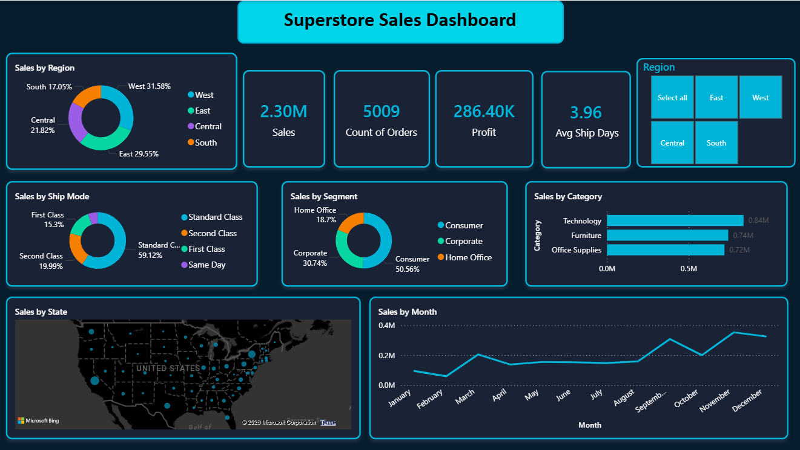

# Sales Performance Dashboard

## Dashboard Preview

## Project Overview
Analyzed 9,994 retail sales records from the Superstore dataset to identify revenue trends, top-performing regions, customer segments, and unprofitable products. Data was cleaned in Python, queried in SQL, and visualized in Power BI.

## Tools Used
- Python (Pandas) — data cleaning and transformation
- SQL (SQLite) — business analysis and querying
- Power BI — interactive dashboard and visualization

## Key Insights Found
- West region generates the highest sales across all regions
- Technology category delivers the strongest profit margins
- Q4 (Oct–Dec) consistently outperforms all other quarters
- 24 products identified as running at negative profit margin

## Files in this Repository
| File | Description |
|---|---|
| `cleaning_script.py` | Python code for data cleaning using Pandas |
| `sql_queries.sql` | SQL queries for business analysis |
| `dashboard_screenshot.png` | Final Power BI dashboard screenshot |
| `superstore_cleaned.csv` | Cleaned dataset used for analysis |
| `README.md` | Project documentation |

## Dataset
- Source: Superstore Sales Dataset (Kaggle)
- Records: 9,994 rows
- Columns: Order ID, Date, Region, Category, Sales, Profit, Quantity, Discount

## Author
Harshitha Guntha
B.Tech CSE — Artificial Intelligence
SVR Engineering College
